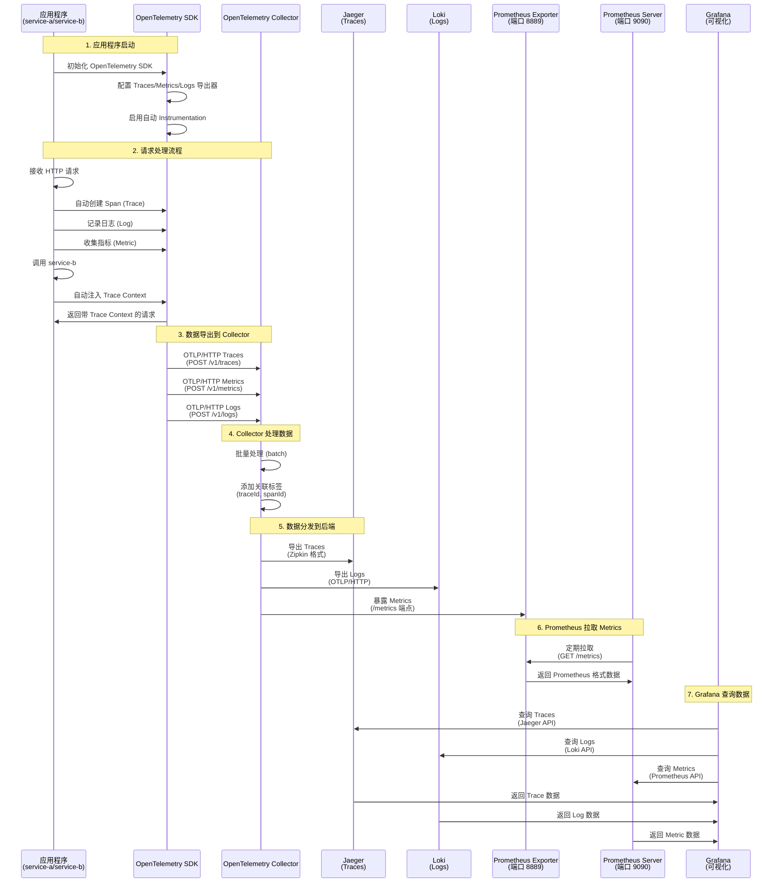

# 🏗️ OpenTelemetry 架构时序图

## 📊 完整架构图



## 🔄 数据流详解

### 1. 应用程序层

```
应用程序 (service-a/service-b)
  ├── Express 服务器
  ├── HTTP 请求处理
  └── 调用其他服务
```

**自动 Instrumentation 捕获：**
- HTTP 请求/响应
- Express 路由
- Axios HTTP 调用
- 系统资源（CPU、内存等）

### 2. OpenTelemetry SDK 层

```
OpenTelemetry SDK
  ├── Traces
  │   └── OTLPTraceExporter → Collector:4318/v1/traces
  ├── Metrics
  │   └── OTLPMetricExporter → Collector:4318/v1/metrics
  └── Logs
      └── OTLPLogExporter → Collector:4318/v1/logs
```

**关键配置：**
- `traceExporter`: 发送 Traces
- `metricReader`: 每 10 秒导出一次 Metrics
- `logRecordProcessor`: 批量处理 Logs

### 3. OpenTelemetry Collector 层

```
OpenTelemetry Collector (端口 4318)
  ├── Receivers: OTLP (HTTP/gRPC)
  ├── Processors:
  │   ├── batch (批量处理)
  │   └── attributes (添加关联标签)
  └── Exporters:
      ├── zipkin → Jaeger:9411
      ├── otlphttp → Loki:3100/otlp
      └── prometheus → 0.0.0.0:8889
```

**处理流程：**
1. 接收 OTLP 数据（Traces、Metrics、Logs）
2. 批量处理提高性能
3. 添加关联标签（traceId、spanId）
4. 分发到不同后端

### 4. 后端存储层

```
┌─────────────┐
│   Jaeger    │ 存储 Traces
│  :16686     │
└─────────────┘

┌─────────────┐
│    Loki     │ 存储 Logs
│   :3100     │
└─────────────┘

┌─────────────┐
│ Prometheus  │ 存储 Metrics
│  Exporter   │ 暴露 :8889/metrics
└─────────────┘
     ↓
┌─────────────┐
│ Prometheus  │ 拉取并存储 Metrics
│  Server     │ 提供 API :9090
└─────────────┘
```

### 5. 可视化层

```
Grafana (:3003)
  ├── Jaeger Data Source → 查询 Traces
  ├── Loki Data Source → 查询 Logs
  └── Prometheus Data Source → 查询 Metrics
```

## 📋 端口映射

| 服务 | 端口 | 用途 |
|------|------|------|
| service-a | 3001 | 应用程序 A |
| service-b | 3002 | 应用程序 B |
| frontend | 3000 | Next.js 前端 |
| Grafana | 3003 | 统一可视化 |
| Jaeger UI | 16686 | Traces 可视化 |
| Loki API | 3100 | Logs 存储 |
| Prometheus | 9090 | Metrics 查询 API |
| Collector OTLP HTTP | 4318 | 接收数据 |
| Collector OTLP gRPC | 4317 | 接收数据 |
| Collector Prometheus | 8889 | Metrics 端点 |

## 🔗 数据关联机制

### Trace Context 传播

```
请求流程：
1. service-a 接收请求
   → 生成 traceId: "abc123"
   → 生成 spanId: "def456"

2. service-a 调用 service-b
   → 自动注入 Trace Context 到 HTTP 头
   → W3C Trace Context: traceparent: 00-abc123-def456-01

3. service-b 接收请求
   → 自动提取 Trace Context
   → 创建子 Span，关联到父 Trace

4. 所有数据都包含相同的 traceId
   → Traces: traceId = "abc123"
   → Logs: traceId = "abc123"
   → Metrics: 通过标签关联
```

### 在 Grafana 中关联查询

```
1. 在 Jaeger 中找到 Trace
   → 复制 traceId: "abc123"

2. 在 Grafana Loki 中查询
   → {trace_id="abc123"}
   → 显示该 Trace 的所有日志

3. 在 Grafana Prometheus 中查询
   → {trace_id="abc123"} 或通过服务名查询
   → 显示该服务的指标
```

## 🎯 关键特性

### 1. 零侵入性
- 自动 Instrumentation 无需修改业务代码
- 自动捕获 HTTP、Express、Axios 等

### 2. 统一协议
- 所有数据使用 OTLP 协议
- 统一发送到 Collector
- Collector 负责分发

### 3. 数据关联
- 自动添加 traceId 和 spanId
- 可以在不同后端中关联查询
- 完整的请求链路追踪

### 4. 可扩展性
- 可以添加更多后端
- 可以添加更多处理器
- 可以添加更多导出器

## 📝 配置要点

### 应用程序配置
```javascript
// tracing.js
const sdk = new NodeSDK({
  traceExporter: new OTLPTraceExporter({
    url: 'http://localhost:4318/v1/traces',
  }),
  metricReader: new PeriodicExportingMetricReader({
    exporter: new OTLPMetricExporter({
      url: 'http://localhost:4318/v1/metrics',
    }),
    exportIntervalMillis: 10000,
  }),
  logRecordProcessor: new BatchLogRecordProcessor(
    new OTLPLogExporter({
      url: 'http://localhost:4318/v1/logs',
    })
  ),
});
```

### Collector 配置
```yaml
# collector-config.yaml
receivers:
  otlp:
    protocols:
      http:
        endpoint: 0.0.0.0:4318

processors:
  batch:
  attributes:
    actions:
      - key: trace.trace_id
        from_attribute: trace_id
        action: insert

exporters:
  zipkin:
    endpoint: http://jaeger:9411/api/v2/spans
  otlphttp:
    endpoint: http://loki:3100/otlp
  prometheus:
    endpoint: "0.0.0.0:8889"

service:
  pipelines:
    traces:
      receivers: [otlp]
      processors: [batch, attributes]
      exporters: [zipkin]
    logs:
      receivers: [otlp]
      processors: [batch, attributes]
      exporters: [otlphttp]
    metrics:
      receivers: [otlp]
      processors: [batch, attributes]
      exporters: [prometheus]
```

### Prometheus 配置
```yaml
# prometheus-config.yaml
scrape_configs:
  - job_name: 'otel-collector'
    static_configs:
      - targets: ['otel-collector:8889']
```

## 🚀 启动顺序

1. **基础设施服务**
   - Jaeger (Traces 存储)
   - Loki (Logs 存储)
   - Prometheus (Metrics 存储)

2. **OpenTelemetry Collector**
   - 接收应用程序数据
   - 处理和分发

3. **应用程序**
   - service-a
   - service-b
   - frontend

4. **可视化**
   - Grafana (统一查看)

## 💡 最佳实践

1. **使用 Collector 作为统一入口**
   - 所有数据先到 Collector
   - Collector 负责处理和分发

2. **启用批量处理**
   - 提高性能
   - 减少网络开销

3. **添加关联标签**
   - 确保所有数据都有 traceId
   - 方便关联查询

4. **使用标准协议**
   - OTLP 协议
   - 易于扩展和维护

